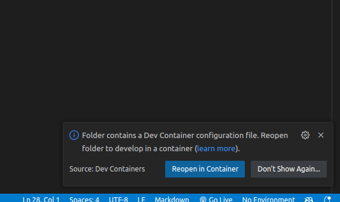
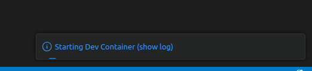
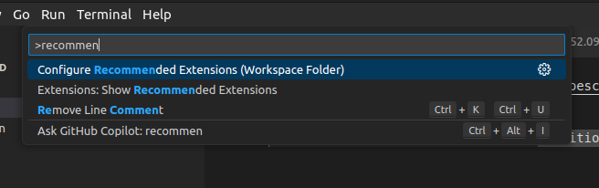
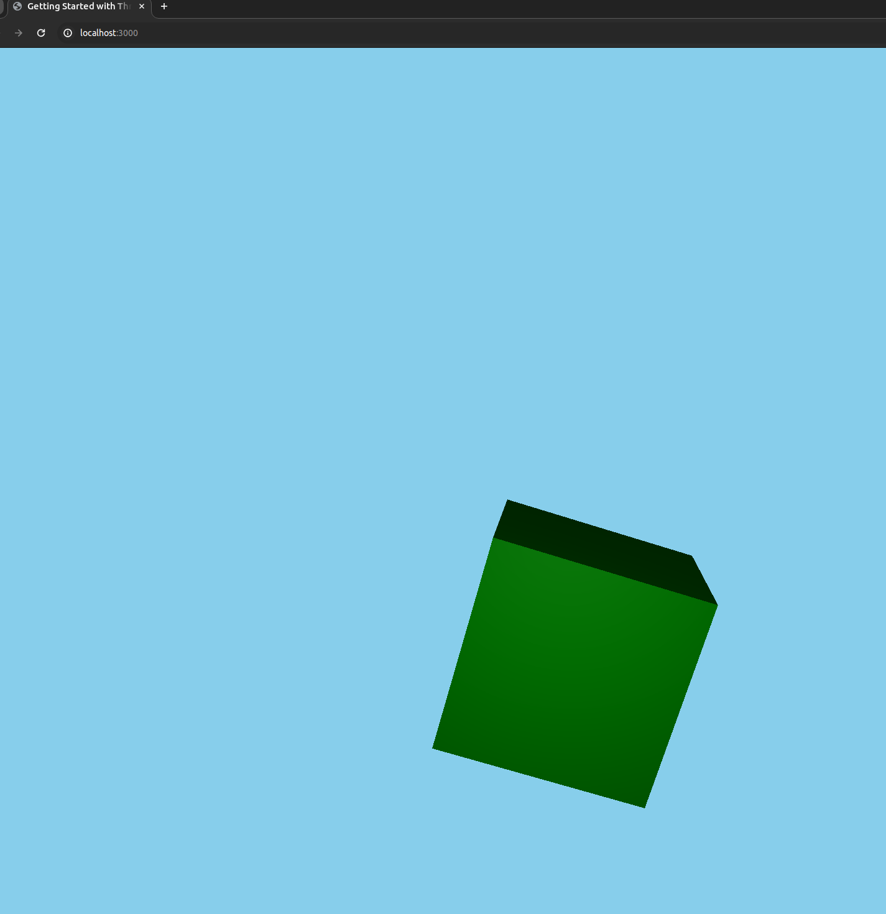

# typescript-webapp-devcontainer

This project is a template that allows you to quickly get started with a Typescript web application using a devcontainer. It is setup to allow you to use all the features of VS Code without having to use the browser debugger or code-editor. It can also be used without devcontainers, or directly via GitHub via CodeSpaces.

## Development Setup

### Using a VS Code Dev Container

Note that this is common infrastructure if you use devcontainers on your system for development and only needs to be installed *once* for *any number* of devcontainer-enabled repositories you want to use.

*If you haven't used devcontainers,  you'll be pleasantly surprised at how flexible, seamless and clean they make even the most complicated dev setup. I really recommend you check this out, it'll change your everything about how you think of dev environments and setup.*

1. Install [Docker](https://www.docker.com/get-started) on your machine if you haven't already.
2. Install [VS Code](https://code.visualstudio.com/download "Install VS Code")
3. Install the VS Code [Dev containers extension](https://marketplace.visualstudio.com/items?itemName=ms-vscode-remote.remote-containers)
4. Clone the repository (or use this template to create your own project):

   ```bash
   git clone https://github.com/aniongithub/typescript-webapp-devcontainer.git
   ```

   or (if you created your own project from this template)

   ```bash
   git clone https://github.com/your-username/project-name.git
   ```
5. Open the project in Visual Studio Code.
6. When prompted, click on the "Reopen in Container" button in the bottom-right corner of the editor. You can also use the Command Palette `(Ctrl/Cmd+Shift+P)` and type/choose `Rebuild and Reopen in Container `

   |  |  |
   | ---------------------------------------------- | ------------------------------------------------------------------------------------------------------------------------------------------------------------------------------------------------------------------------------------------------------------------------------------------------------------------------------------------------------------------------------------------------------------------------------------------------------------------------------------------------------------------------------------------------------------------------------------------------------------------------------------------------------------------------------------------------------------------------------------------------------------------------------------------------------------------------------------------------------------------------------------------------------------ |
7. Wait for the devcontainer to build. This might take a few minutes depending on your internet connection.
   
8. When the devcontainer is ready, you can use `Ctrl/Cmd+Shift+B` (choose `npm:build`) to build the project
9. Press `F5` to launch it. A new browser window will open, showing you a rotating green cube on a sky blue background.
10. You can now use breakpoints in VS Code or setup the default build task to be `npm:watch` if you want any changes to automatically be compiled and available in the debug browser. Note that you may need to press `Shift+F5` to force the browser to refresh any changes.

### Github CodeSpaces

*TODO*

### Non-Devcontainer Based Development

1. Clone the repository:

   ```bash
   git clone https://github.com/aniongithub/typescript-webapp-devcontainer.git
   ```

   or (if you created your own project from this template)

   ```bash
   git clone https://github.com/your-username/project-name.git
   ```
2. Install the required dependencies:

```bash
   cd project-name
   npm install
```

3. Install the recommended extensions (from `.vscode/extensions.json`)
   
4. Press `F5` to launch the debugger. A new browser window will open, showing you a rotating green cube on a sky blue background.
   
5. You can now use breakpoints in VS Code or setup the default build task to be `npm:watch` if you want any changes to automatically be compiled and available in the debug browser. Note that you may need to press `Shift+F5` to force the browser to refresh any changes.

## License

This project is licensed under the [MIT License](LICENSE).
